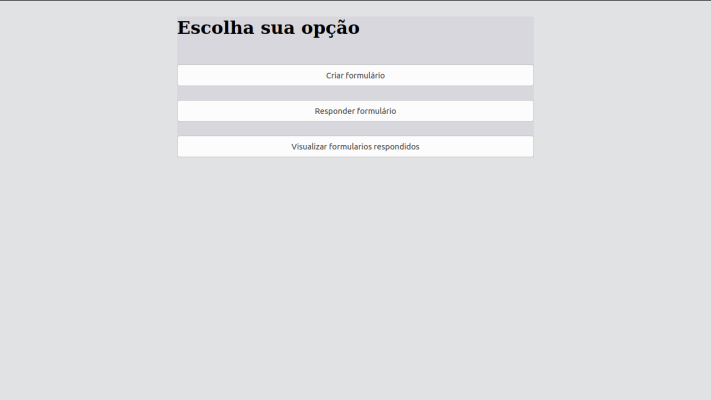
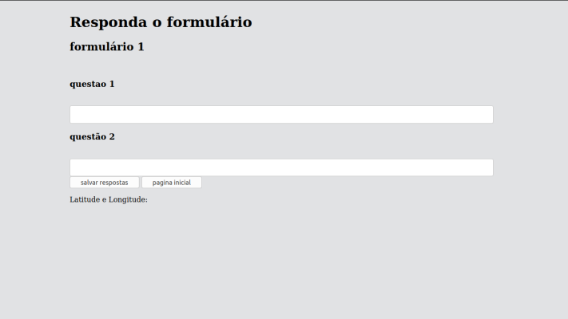
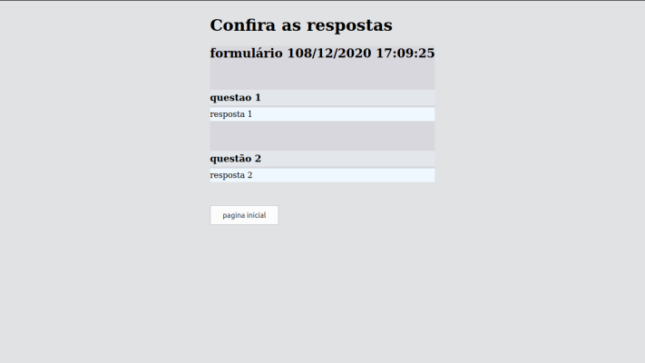

# Geotools
> Criar e responder formularios

Um pequeno projeto para criar um formulario que podem ser adicionadas perguntas, para responder as perguntas criadas e para visualizar os formularios criados e respondidos.
Este projeto foi desenvolvido evitando utilizar frameworks, utilizando apenas JavaScript, HTML, CSS e JSON.

## Instalação

Não precisa ser instalado, apenas abra em um navegador a pagina index.html que esta dentro da pasta public.

## Exemplo de uso

Crie um formulário com o nome do mesmo, seu nome e as questões que serão respondidas.

na tela inicial pode escolher entre criar, responder formulários criados e consultar os criados e respondidos.

tela para resposta de um formulário escolhido.

tela para vizualizar as respostas do formulário escolhido.

